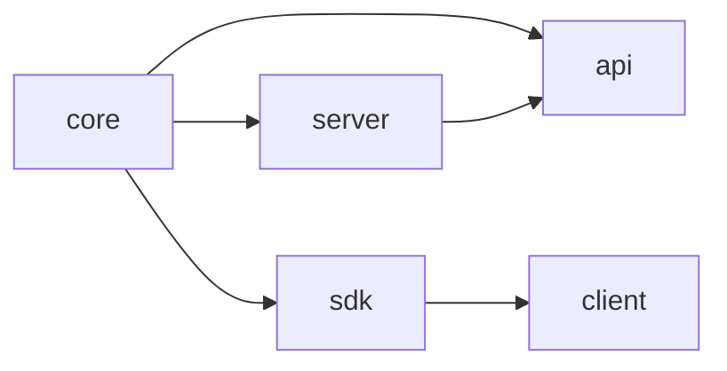

# turbotree

turbotree uses [turbowatch](https://github.com/gajus/turbowatch) and [turbo](https://turbo.build) to

- determine the dependencies in your monorepo (using [workspace-tools](https://microsoft.github.io/workspace-tools/)), and
- rebuild packages _and their dependents_ in the proper order when changes happen.

turbotree works with monorepos based on [workspaces](https://docs.npmjs.com/cli/using-npm/workspaces).

## Getting started

Here's a complete example "watch.ts" script:

```typescript
import { KickstartContext, PackageInfo, Trigger, watchTree } from "turbotree";

const triggers = (p: PackageInfo): Trigger[] => [
  {
    expression: tsViteBuild(p),
    name: `${p.name}:build`,
    initialRun: false,
    onChange: async ({ spawn, files }) => {
      console.log(`${p.root}: changes detected: ${files.map((f) => f.name)}`);
      await spawn`npx turbo build --output-logs=new-only ${p.turboFilterFlags}`;
    },
  },
];

const kickstartCommand = async (k: KickstartContext) =>
  k.$`npx turbo build --output-logs=new-only ${k.turboFilterFlags}`;

watchTree(__dirname, triggers, kickstartCommand);
```

With a "package.json" correctly set up with workspaces, this is all you need to watch your entire tree.

### Triggers

The first argument to "watchTree" is a function that can generate triggers, which are [the same triggers turbowatch uses](https://github.com/gajus/turbowatch#api) (in fact, they're passed directly to turbowatch).

That function is supplied a package info object which has things like the package name, its root directory, information about the dependency tree from that package's vantage point, and a set of filter flags for turbo.

The filter flags are the most important part; they are used to construct a command that will tell turbo to rebuild the _leaves_ of the dependency tree when this package changes. turbo is then relied on to figure out what packages to (re)build and in what order.

So, for example, given this dependency tree:



If changes are detected in "core", the filter flags ask turbo to build both "api" and "client". If changes are detected in "server", turbo will be asked to build only "api".

In both cases, turbo will rebuild a package and all related packages under its control. So, for "core", it would rebuild all packages. For "api", it would build "core", "api", and "server".

When turbo builds each package, it checks to see if anything has actually changed first. If it hasn't, it won't actually do the build.

In short, we tell turbo exactly once when files change what the relevant parts of the tree are, and rely on turbo itself to determine what actually needs rebuilding.

### Kickstart

Of course, triggers only fire when changes are detected. If the watch script isn't running, it can't detect changes.

turbotree has optional support for a "kickstart" in this case. The kickstart context that is passed in to a kickstart function will contain turbo filter flags, as before, as well as a reference to [zx](https://github.com/google/zx) that can be used to execute a command.

The filter flags will describe all leaves of the dependency tree. In this case, the kickstart will build everything (and, again, turbo will skip things that are already built) one time before the watcher takes over.

## Watch expressions

turbowatch triggers have an "expression" property that describes the watch [expression](https://github.com/gajus/turbowatch#expressions) that will trigger that particular rule. (See that documentation for more information on how to build an expression.)

In the [quick start](#quick-start) above, we use a prebuilt watch expression included with turbotree. This expression is designed for packages that

- have TypeScript, CSS, and/or HTML source code in "src",
- may have an "index.html" in the root of the project (such as with [Vite](https://vitejs.dev) projects)
- build into "dist" and/or "lib"

You can, of course, write any turbowatch-compatible watch expression you wish.

## Additional triggers

The trigger builder function you pass to turbotree doesn't just take a single trigger, but allows you to pass an arbitrarily-sized list of triggers—even none at all.

For example:

```typescript
const START = ["client"];

const triggers = (p: PackageInfo): Trigger[] => {
  const build: Trigger = {
    expression: tsViteBuild(p),
    name: `${p.name}:build`,
    initialRun: false,
    onChange: async ({ spawn, files }) => {
      console.log(`${p.root}: changes detected: ${files.map((f) => f.name)}`);
      await spawn`npx turbo build --output-logs=new-only ${p.turboFilterFlags}`;
    },
  };

  const start: Trigger = {
    expression: ["dirname", "lib"],
    name: `${p.name}:start`,
    initialRun: true,
    interruptible: true,
    onChange: async ({ spawn }) => {
      await spawn`cd ${p.root} && npm start`;
    },
    persistent: true,
  };

  return START.includes(p.name) ? [build, start] : [build];
};
```

In this example, all packages get the prebuilt watch expression we saw earlier, but a few also get another trigger that runs a persistent server, then restarts it when its code is rebuilt—e.g. after dependency packages have finished rebuilding.
